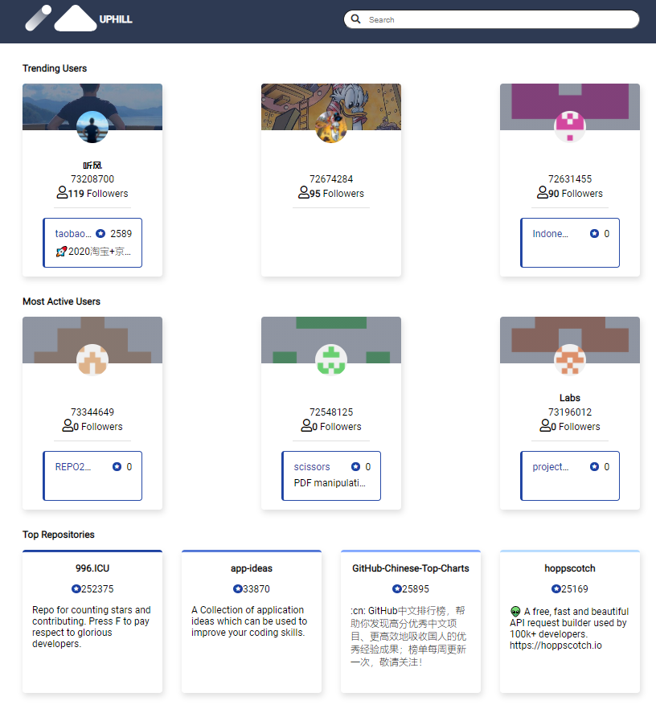
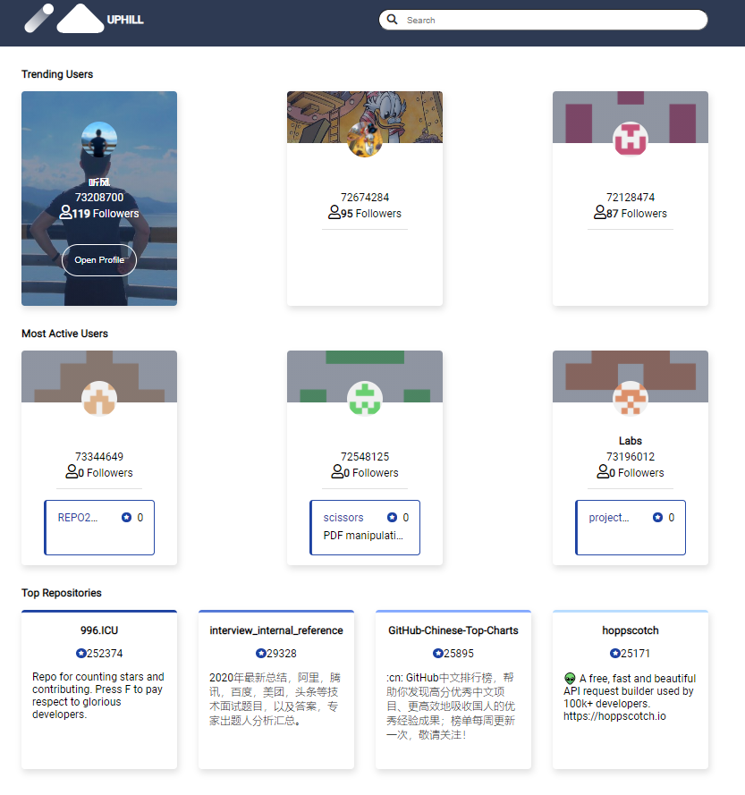
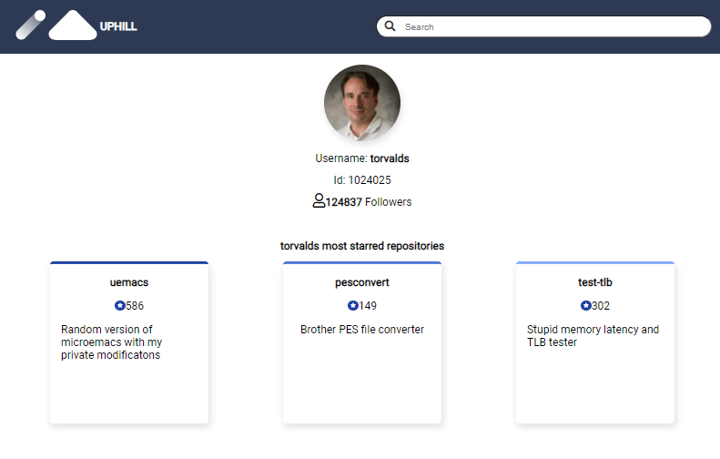
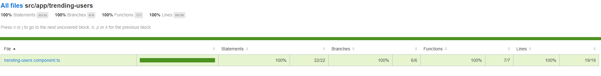

# UpHill challenge

## Comments

The challenge was not difficult or complex the main problem I had was the requirements because there are a lot of them.

For development and aestetich purposes the card of the repositories inside the user card was hidden.

There was some issues with the github API it does not work perfectly...

## How to run
To run the project simply type 

```ng s ``` 

in the folder of the project

The result of executing the command will be something like this depending on the resolution of the screen and data returned by the service







## How to run the unit tests

To run the tests type 
```ng test``` 
in the folder of the project

The coverage of the unit tests in the requested screen is the following:




## Goal of UpHill challenge

The goal of this project was to complete the uphill Frontend Developer Challenge and develop a web-based GitHub dashboard to show the most popular GitHub users, the most active GitHub users and their popular repositories.

## Deliverable
•	This task was implemented using Angular.

## User Journey
•	As a user, when I enter the GitHub Dashboard I want to find the 3 most popular users, the 3 most active users and the 4 top repositories. When I click on a specific user, I want to be redirected to his GitHub profile.

### User Stories
•	Develop a web app to achieve the following features:
1.	As a user I want to know the 3 most popular github users — the ones created in the last month and having the most followers;
2.	As a user I want to know the 3 most active users — the ones created last month and having the most contributions;
3.	As a user I want to see the name, image, id, total followers and the most starred project of each github user;
4.	As a user I want to be redirected to the user’s github page when I click on “Open Profile”;
5.	As a user I want to see the most starred repositories created last year, sorted by total stars;
6.	As a user I want to see the name, description and total stars of each repository.
7. As a user I want to search users and repositories for a specific term
•	Bonus tasks:
8.	Write a test for the 3 most popular github users feature.
9.	Instead of redirecting the user to the github.com page, after clicking “Open Profile”, open a new page with the user’s details and his 3 top repositories;

## Resources
•	GitHub Api: https://developer.github.com/v3/

•	Search users: https://docs.github.com/en/github/searching-for-information-on-github/searching-users
